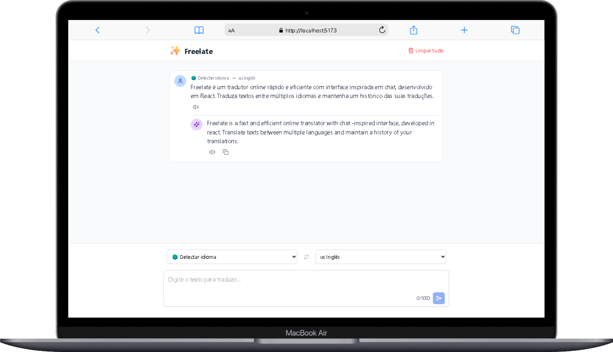

# Traduza - Tradutor Online

 <!-- Adicione uma screenshot real depois -->

Traduza é um tradutor online rápido e eficiente com interface inspirada em chat, desenvolvido em React. Traduza textos entre múltiplos idiomas e mantenha um histórico das suas traduções.

## Funcionalidades Principais

- 🌍 Tradução entre 25+ idiomas
- 🔍 Detecção automática do idioma de origem
- 🔊 Pronúncia de textos nos idiomas suportados
- 📋 Copiar traduções para a área de transferência
- ⏳ Histórico de traduções persistente (localStorage)
- 🔄 Troca rápida entre idiomas de origem e destino
- 🎨 Modo claro e escuro

## Idiomas Suportados

- Português 🇵🇹
- Inglês 🇺🇸
- Espanhol 🇪🇸
- Francês 🇫🇷
- Alemão 🇩🇪
- Italiano 🇮🇹
- Japonês 🇯🇵
- Chinês 🇨🇳
- Russo 🇷🇺
- Árabe 🇸🇦
- E mais...

## Como Usar

1. Digite o texto que deseja traduzir na área de entrada
2. Selecione o idioma de origem (ou "Detectar idioma")
3. Selecione o idioma de destino
4. Clique no botão de traduzir (ou pressione Enter)
5. A tradução aparecerá na área de mensagens

### Atalhos Úteis

- **Enter**: Traduzir texto
- **Shift+Enter**: Nova linha no campo de texto
- **Ícone de troca**: Alterna entre idiomas de origem e destino

## Gerenciamento de Histórico

- Todas as traduções são salvas automaticamente
- Passe o mouse sobre uma tradução para ver o botão de remover (❌)
- Use o botão "Limpar tudo" no cabeçalho para apagar todo o histórico

## Tecnologias Utilizadas

- React (Vite)
- Tailwind CSS
- Lucide Icons
- Lingva Translate API
- Web Speech API (para pronúncia)

## Instalação Local

1. Clone o repositório:
   ```bash
   git clone https://github.com/seu-usuario/traduza.git
   cd traduza
   npm i
   npm run dev